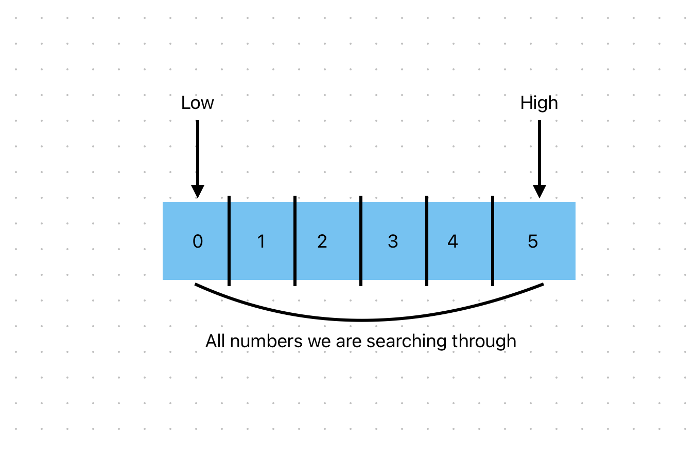

# Binary Search Notes

- **Algorithm Overview:**

  - Binary search is an efficient algorithm for finding the position of an element in a sorted list.
  - It compares the target element to the middle element of the list; if they are not equal, it halves the list and repeats the process on the relevant half.
  - The search ends when the element is found or the sublist cannot be halved further (the element is not present).

- **Function Parameters:**

  - Binary search takes two parameters:
    1. The list to search within.
    2. The element to search for.

- **Performance:**

  - The running time in Big O notation is O(log n), where 'log' refers to the logarithm base 2.
  - In a worst-case scenario, binary search will check at most log₂(n) elements.

- **Conditions for Use:**
  - The list must be sorted for binary search to work correctly.

<table>
<tr>
<td>

### Implementation Steps:

- Initialize two pointers: `low` at index 0 and `high` at index `len(list) - 1`.
- Calculate the middle index: `mid = (low + high) / 2`.
- The `guess` is the element at the middle index: `guess = list[mid]`.
- If the `guess` is too low, update `low` to `mid + 1`.
- If the `guess` is too high, update `high` to `mid - 1`.
- Repeat the process until the element is found.
- If the element is not found, it probably `does not exist in the list`.

</td>
<td>

</td>
</tr>
</table>

- **Important Note:**

  - Each iteration of the binary search algorithm eliminates half of the remaining elements, which is why it's more efficient than linear search.

- **Real-Life Implementations:**

  - **Music or Media Libraries:** Searching for a specific song or artist in a digital music library sorted alphabetically or by other criteria.

  - **Phone Book Search:** Locating a contact in a phone book. Rather than going through each page, you can open to a middle page and continue halving the search area based on alphabetical order.

  - **Dictionary Lookup:** Finding a word in a dictionary. Instead of reading each entry, you would start around the middle and adjust your search based on alphabetical sorting.
