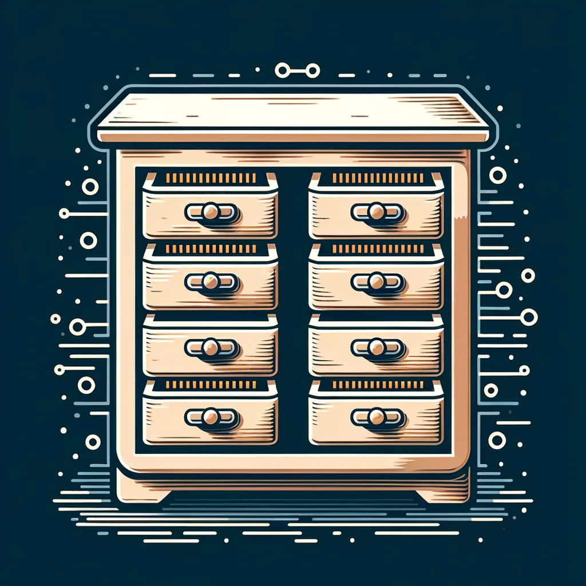
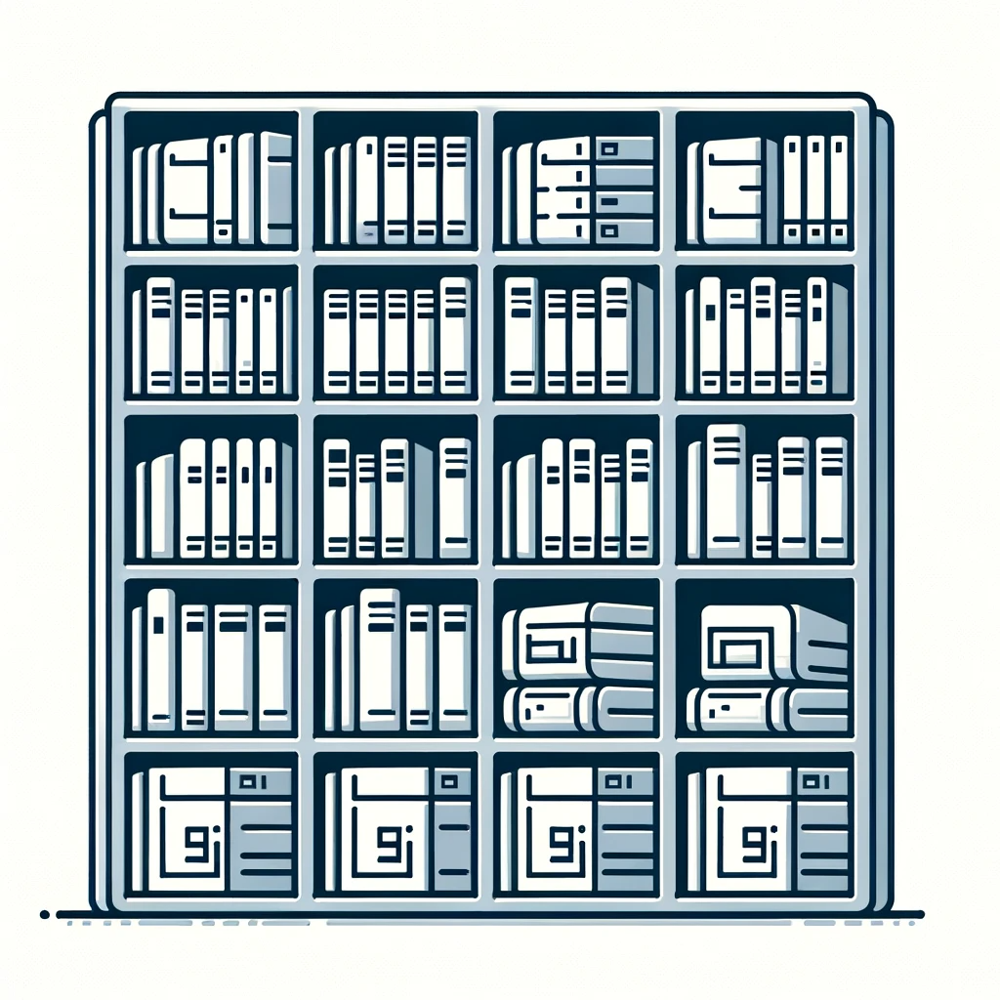
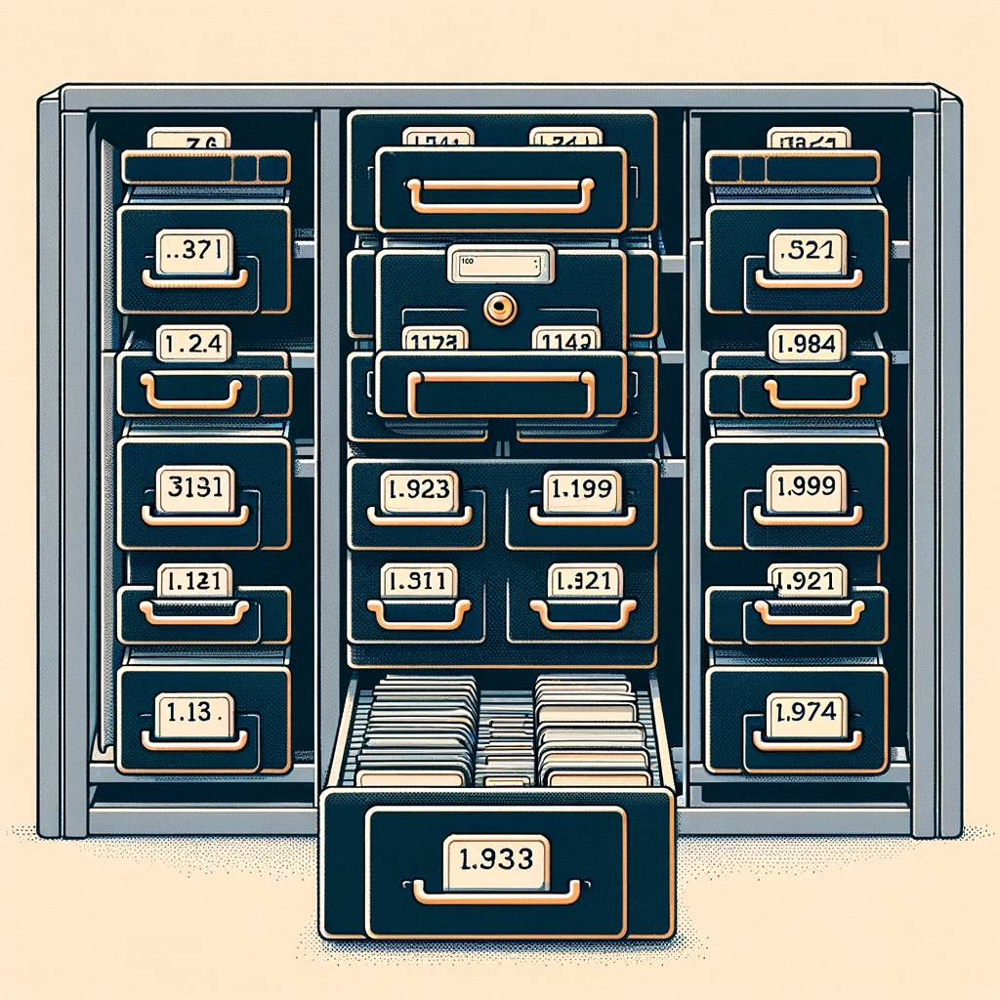

# Understanding Computer Memory

Computer memory is a technology that allows computers to store data and programs temporarily or permanently. It's an essential component of the computer that enables it to process data, run applications, and perform tasks. Memory comes in various forms, such as RAM (random access memory), which is fast and volatile, meaning it loses its content when the power is off, and storage memory, like SSDs or HDDs, which keep data permanently until it's erased or overwritten.

Now, let's explore the analogy of a chest of drawers to help understand how memory works in layman's terms.

## Chest of Drawers (Computer Memory)

Imagine a chest of drawers in your home. Each drawer can hold different items, just like memory in a computer holds different pieces of data.

## Items in Drawers (Data)

Think of each item you place in a drawer as a piece of data stored in the computer's memory. Just like items, each piece of data has its own place.

## Storing Items (Writing Data to Memory)

When you store items in a drawer, you are using a space to keep your things organized and out of sight, similar to how data is stored in memory locations.

## Retrieving Items (Accessing Data)

Whenever you need something, you go to the specific drawer where the item is stored and retrieve it. This is akin to accessing data from a specific memory location in a computer.

## Drawer Labels (Memory Addresses)

You might label each drawer with a list of items inside or a category. In the world of computers, each 'drawer' has a memory address, helping the system know where each piece of data is stored.

# Understanding Computer Memory: A Library Analogy

## Library and Bookshelves (Computer Memory)

Imagine a library filled with bookshelves. These bookshelves are well-organized with rows and columns, each shelf ready to hold books. This is similar to how computer memory is structured, where each 'shelf' is like a segment of memory ready to hold data.

## Books (Data)

In our library, books represent data. Each book has a unique identifier, like an ISBN, akin to a memory address in a computer. The books can be accessed, read, and re-shelved.

## Storing Books (Writing Data to Memory)

When a new book arrives, it's cataloged and placed on the correct shelf. This is like writing data to memory, where each piece of data is stored at a specific address.

## Finding Books (Accessing Data)

If you want to find a book, you look it up in the catalog to get its location, and then you retrieve it from the shelf. This is how a computer accesses data - it uses the memory address to locate and retrieve the data.

## Library Catalog (Memory Addressing)

The library catalog, with its system of cards and drawers, organizes the locations of all the books. In a computer, the memory addressing system keeps track of where each piece of data is stored.

