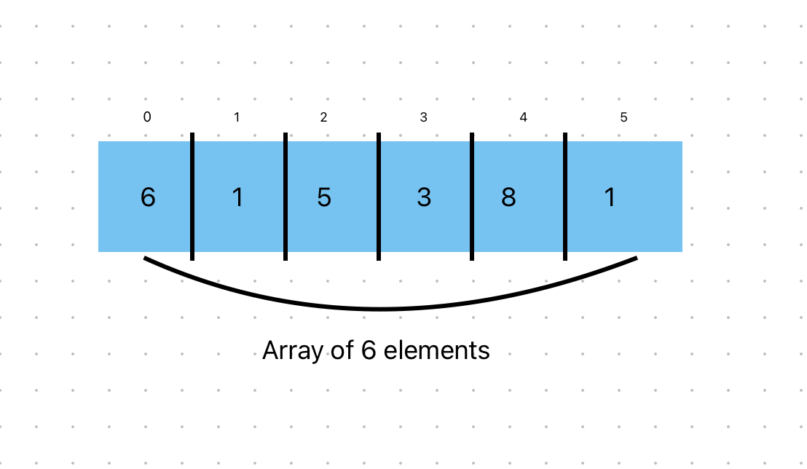
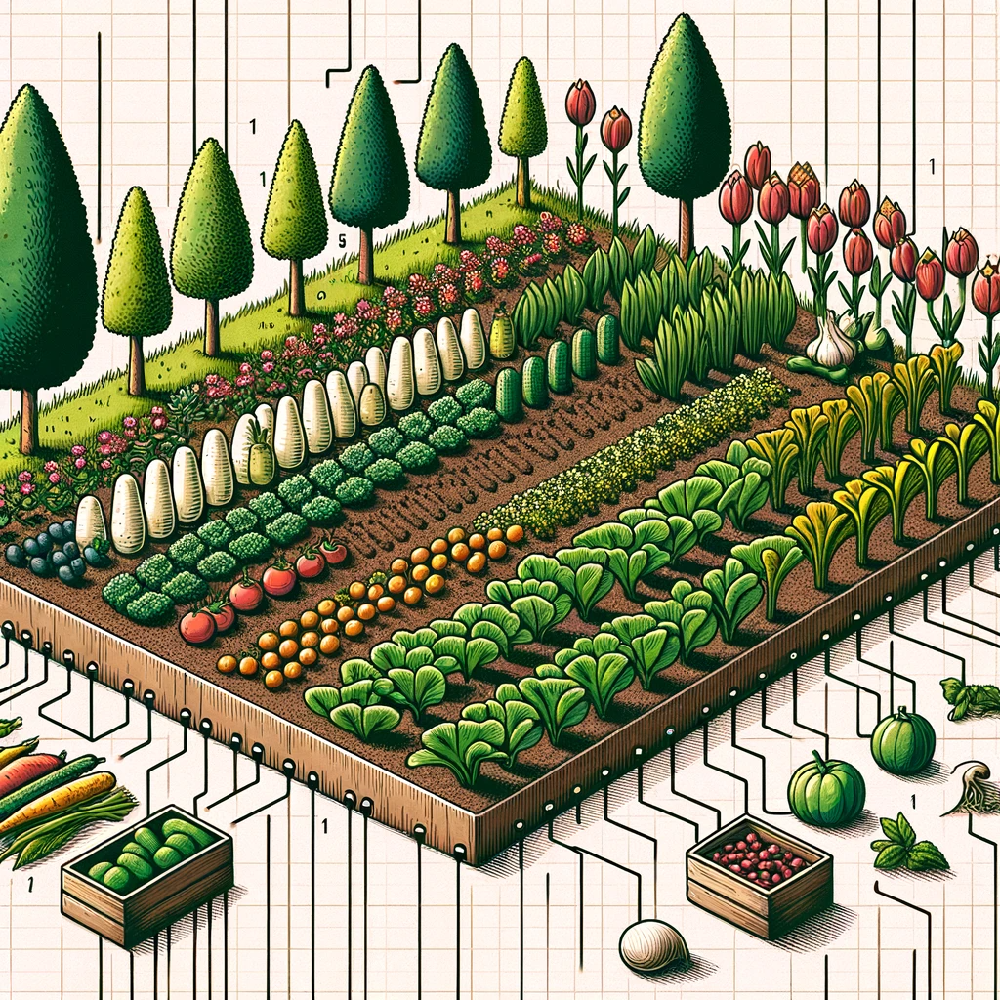
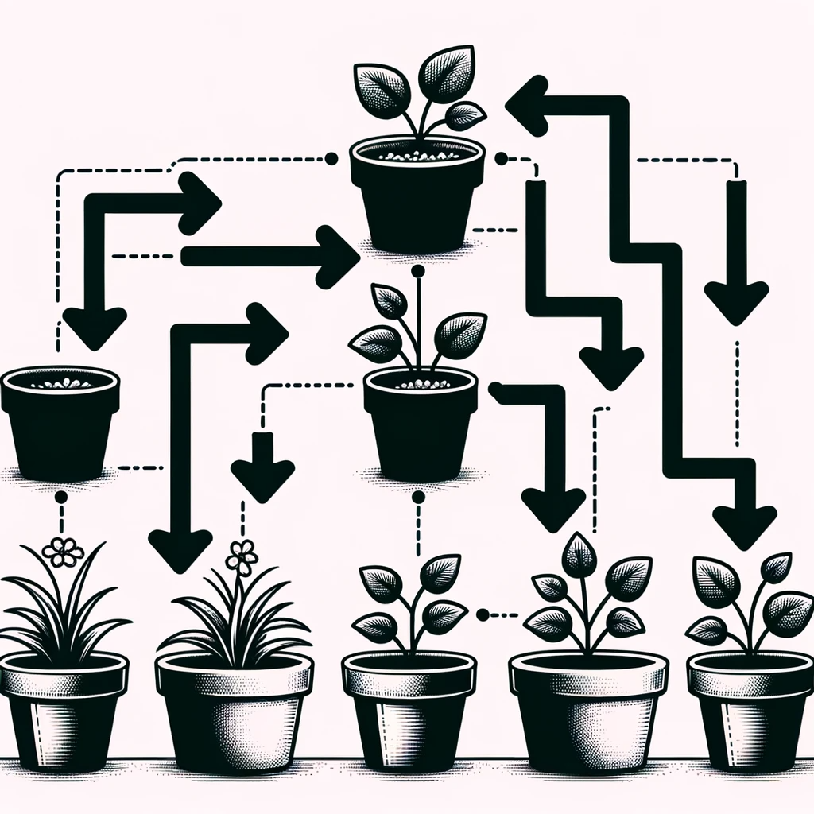

# ARRAYS

### When we say Array, what do we mean?

In layman's terms, an array is like a row of storage boxes, all lined up next to each other. Each box can hold a piece of information or an item, and these boxes are numbered in order, starting from the first box. You can easily access any box by referring to its number.

For example, imagine you have a row of boxes to store numbers: [3, 7, 1, 9, 4]. This is like an array of numbers. The first box (box number 1) contains the number 3, the second box (box number 2) contains 7, and so on. You can quickly find or change the number in any specific box by mentioning its number, making it easy to organize and work with lots of data.

- **_*Using an array means that all your tasks or pieces of information are stored in a sequence, right next to each other, in computer memory.*_**

### Definition of an Array:

An array is a data structure in computer science that consists of a collection of elements or values, each identified by an index or a key. These elements are stored in contiguous memory locations, allowing for efficient and direct access based on their position within the array. Arrays are typically used to store and manage multiple pieces of data of the same data type, organized in a linear or sequential fashion.



- **Array Indices:**

  - In the depicted image, the numbers on top of each box are known as indices (singular: index).
  - Indices are used to identify each position or slot in an array.

- **Zero-Based Indexing:**

  - Arrays typically start from index 0, not 1.
  - This means the first element in the array is at index 0, the second at index 1, and so forth.

- **Importance in Programming:**
  - Zero-based indexing is a standard in many programming languages.
  - It simplifies calculations related to the memory address of each element.
  - Understanding zero-based indexing is crucial for effectively navigating and manipulating arrays in coding.

# Arrays and Memory Allocation: A Gardening Analogy

Sometimes you need to store a list of elements in memory, much like a gardener who needs to organize their garden. An array is like a garden plot segmented into fixed sections where each section can hold one type of vegetable.


_Image: A full garden plot, symbolizing a full array._

When the gardener's plot is full and they want to plant new vegetables, they face a dilemma. There's no room to add to the existing plot. Similarly, when an array is full and you want to add more elements, you can't simply extend it because it has a fixed size.


_Image: Garden looking at full garden plot, thinking of how to accomodate more vegetables._

If the gardener wants to accommodate more types of vegetables, they have to find a new, larger piece of land. They will then have to move all the existing plants to this new plot before they can plant new ones. In computer terms, this means creating a new, larger array and copying all the elements from the old array to the new one before adding the new elements.


_Image: Gardener preparing a new, larger garden plot, representing creating a new, larger array._

The new plot is akin to allocating more memory for a larger array, but it's also like **"holding seats"** — the gardener may prepare extra space in the new plot for future plants. This ensures that for a while, the gardener can add new vegetables without reworking the garden. **However, just like with arrays, there are drawbacks.** If the gardener prepares too much unused space, it can lead to wasted resources, and if the garden grows even more, they might eventually need to expand again.

- **The big question here is : Can the gardener keep on expanding everytime the current plot is full?**

In computer memory, just like in our garden analogy, if an array needs to accommodate more elements than it was initially created for, it's not possible to simply add a new plot (or segment of memory) for the new elements. Instead, you must create a new, larger array that can hold all the old elements plus the new ones. This is analogous to the gardener needing to find a larger piece of land to accommodate both the existing and the new vegetables, and then transplanting the old vegetables into the new, larger garden alongside the new ones.

# LINKED LIST

Back to our big question.

**_CAN THE GARDENER KEEP ON EXPANDING EVERYTIME THE CURRENT PLOT IS FULL?_** This is where **Linked List** comes in.

What if the gardener used pots instead of planting directly in the ground? Each pot could hold a different plant, and they could add more pots anytime without affecting the others. This is like a **_linked list_** in computer science, where each element has a pointer to the next one, allowing the structure to grow dynamically.


_Image: Sequence of potted plants, illustrating a linked list._

This flexibility solves the problem of adding new elements.

## What's a linked list?

A linked list is a fundamental data structure in computer science and programming. It is used to organize and store a collection of elements, called nodes, in a linear order. Each node in a linked list contains two components:

1. Data: This is the actual value or information that the node stores.

2. Reference (or pointer): This is a reference to the next node in the list, which allows you to navigate from one node to the next.

- The first node in a linked list is called the head, and it is used as the starting point for traversing the list.

- The last node typically has a reference to null or some sentinel value to indicate the end of the list.

Linked lists come in several variations, including singly linked lists, doubly linked lists, and circular linked lists:

1. Singly Linked List: In a singly linked list, each node has a reference to the next node in the list, forming a unidirectional chain. It is simple and memory-efficient but does not allow easy traversal in reverse order.

2. Doubly Linked List: In a doubly linked list, each node has references to both the next and the previous nodes in the list. This bidirectional linkage allows for more flexible traversal in both directions but consumes more memory.

3. Circular Linked List: In a circular linked list, the last node's reference points back to the first node, creating a closed loop. This can be useful in certain scenarios, such as creating a circular buffer.

- Linked lists are commonly used when you need dynamic memory allocation and deallocation, as they can easily grow or shrink in size. They are often used as building blocks for other data structures like stacks, queues, and hash tables.

Here's a simple representation of a singly linked list in pseudocode:

```plaintext
Node:
  - data   // The value stored in the node
  - next   // Reference to the next node

Linked List:
  - head   // Reference to the first node in the list
```

Operations on linked lists typically include inserting and deleting nodes, traversing the list, and searching for specific elements.

- In linked lists, you can't directly read an item by its address; instead, you sequentially navigate through the list from the start to find an item.

- Linked lists are efficient for sequential access, as you read items one after another.

**Arrays provide direct access to any item using its index, allowing for efficient random access without sequential traversal.**

Below are the run times for common operations on arrays and lists.

| Operation     | Arrays | Linked Lists |
| ------------- | ------ | ------------ |
| **Reading**   | O(1)   | O(n)         |
| **Insertion** | O(n)   | O(1)         |
| **Deletion**  | O(n)   | O(1)         |

**O(n) - Linear time**

**O(1) - Constant time**
